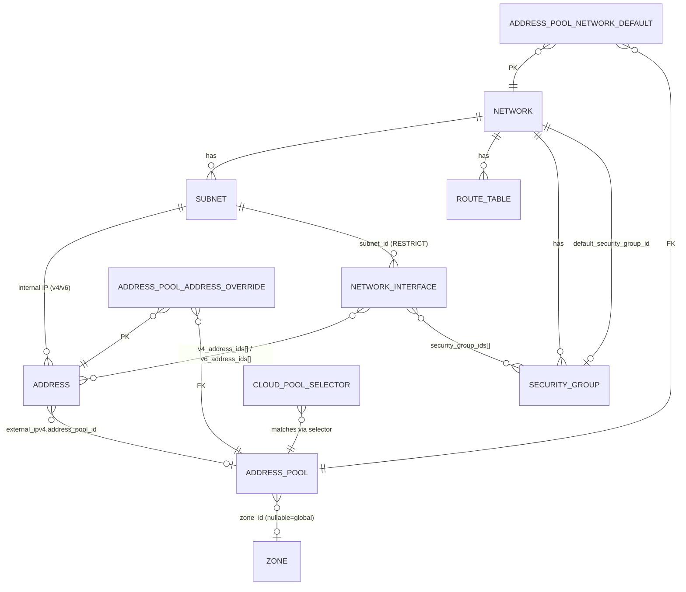

# 01 — Resources

Детально по каждому ресурсу. Поля, инварианты, связи, спецчастности.

## Иерархия и связи

> `Zone`/`Region` — это домен `kacho-compute` (эпик KAC-15); в `kacho-vpc`
> `subnet.zone_id` / `address_pool.zone_id` / `address.external_ipv4.zone_id` —
> просто `TEXT`-id без FK, валидируется на request-path через
> `compute.v1.ZoneService.Get`.

## Public ресурсы (verbatim YC, folder-scoped)

### Network

Контейнер для Subnet/RouteTable/SG. Базовая VPC-сеть.

| Поле | Тип | Замечания |
|---|---|---|
| `id` | text PK, prefix `enp` | |
| `folder_id` | text NOT NULL | `networks_folder_id_name_key` UNIQUE(folder_id, name) |
| `name` | text | NameVPC permissive |
| `description` | text | ≤256 |
| `labels` | jsonb | ≤64 пар |
| `default_security_group_id` | text NULL FK→`security_groups` | устанавливается inline в `doCreate` при `KACHO_VPC_DEFAULT_SG_INLINE=true` (default). ON DELETE SET NULL |
| `vpn_id` | integer NOT NULL UNIQUE | **internal-only** — 24-bit data-plane-идентификатор сети (epic KAC-2); аллоцируется на Network.Create (`SEQUENCE vpn_id_seq` + free-list `vpn_id_free`, миграция 0005), стабилен, возвращается во free-list на Network.Delete. **НЕ в публичном `Network` API** — только в `InternalNetwork{network, vpn_id}` через `InternalNetworkService.GetNetwork` / REST `GET /vpc/v1/networks/{network_id}/internal` (internal mux). |
| `created_at` | tstz | в proto-ответе truncate до секунд |

**Инварианты**:
- При Create (`KACHO_VPC_DEFAULT_SG_INLINE=true`, default) — атомарно создаётся
  Network + Default SG + биндинг `default_security_group_id` в одной TX worker'а.
  Раньше это был отдельный reconciler в `kacho-vpc-controllers` — упразднён в Phase 2.
  При `=false` Network создаётся без SG (для load-тестов / внешнего reconciler'а).
- `vpn_id` аллоцируется в `doCreate` (берётся head free-list, иначе `nextval(vpn_id_seq)`)
  и освобождается в Delete-worker'е перед удалением строки. Это инфра-чувствительные данные —
  см. workspace `CLAUDE.md` §«Инфра-чувствительные данные»; на публичной поверхности его нет.
- `Move` (между folder'ами) — отдельный RPC.
- Hard-delete; FK от Subnet/RT/SG = RESTRICT.

### Subnet

Подсеть в Network, привязана к Zone.

| Поле | Тип | Замечания |
|---|---|---|
| `id` | text PK, prefix `e9b` | |
| `folder_id`, `network_id`, `zone_id` | text NOT NULL | immutable после Create; `subnets_folder_id_name_key` UNIQUE(folder_id, name) WHERE name<>'' (миграция 0002) |
| `name`, `description`, `labels` | | |
| `v4_cidr_blocks` | text[] DEFAULT `'{}'` | **опционально на Create** (proto-`(required)` снят, миграция не нужна); главный — `[0]`. CIDR-less подсеть легальна — `Address.Create` с internal-IPv4-спеком в неё / `AllocateInternalIP` → `FailedPrecondition "subnet ... has no IPv4 CIDR"`; добавить CIDR позже через `:add-cidr-blocks` |
| `v6_cidr_blocks` | jsonb | dual-stack; добавляется/удаляется через `:add-cidr-blocks`/`:remove-cidr-blocks` (валидный IPv6-префикс, host-bits=0, intra-request disjoint; cross-subnet backstop — EXCLUDE `subnets_no_overlap_v6`) |
| `v4_cidr_primary` | text computed | для EXCLUDE constraint (см. ниже) |
| `route_table_id` | text NULL FK→`route_tables` | optional |
| `dhcp_options` | jsonb | domain_name (RFC 1123), dns/ntp servers |

**Инварианты**:
- CIDR overlap **запрещён** в пределах Network — DB-level через
  `EXCLUDE USING gist` (миграция 0007), v4 и v6. Маппится в `FailedPrecondition
  "Subnet CIDRs can not overlap"` (для v6 — overlap из `:add-cidr-blocks` → `FailedPrecondition`).
- `v4_cidr_blocks` / `v6_cidr_blocks` **необязательны** на Create — подсеть может быть
  CIDR-less; реальное добавление/удаление блоков (обеих семей) — через verbs
  `:add-cidr-blocks` / `:remove-cidr-blocks` (они теперь принимают и `v6_cidr_blocks`).
  `UpdateSubnet` получил `v6_cidr_blocks` — soft-immutable / no-op (зеркало v4).
- `Relocate` отвергается, если у Subnet есть Address-ресурсы (verbatim YC
  `FailedPrecondition "Invalid subnet state"`).
- `AddCidrBlocks` второй+ CIDR не покрывается DB EXCLUDE (constraint
  смотрит только на `v4_cidr_primary`). Защищено сервис-level через
  `networkRepo.List` cross-check.
- **Удаление подсети** блокируется (sync-precheck в `SubnetService.Delete`):
  есть внутренние Address (v4 ИЛИ v6 — `AddressesBySubnet` смотрит и `internal_ipv4`,
  и `internal_ipv6`) → `FailedPrecondition "Subnet has allocated internal addresses"`;
  затем — есть `NetworkInterface` → `FailedPrecondition "subnet ... has N network interface(s) (...); delete them first"`.
  DB-backstops: `addresses_internal_subnet_fkey` (на generated-колонке `addresses.internal_subnet_id`,
  выводимой из `internal_ipv4` ИЛИ `internal_ipv6` — миграция 0013) и `network_interfaces_subnet_id_fkey ON DELETE RESTRICT`.

### Address

External (folder-scoped public IP) или internal (IP в Subnet).

| Поле | Тип | Замечания |
|---|---|---|
| `id` | text PK, prefix `e9b` | |
| `folder_id` | text NOT NULL | |
| `addr_type` | smallint | 0=unspec, 1=external, 2=internal |
| `ip_version` | smallint | |
| `external_ipv4` | jsonb | `{address, zone_id, address_pool_id, requirements}` |
| `internal_ipv4` | jsonb | `{address, subnet_id}` |
| `internal_ipv6` | jsonb | `{address, subnet_id}` (миграция 0009; oneof `Address.internal_ipv6_address` — `{address, oneof scope{subnet_id}}`) |
| `internal_subnet_id` | text computed | derived из `internal_ipv4->>'subnet_id'` **ИЛИ** `internal_ipv6->>'subnet_id'` (миграция 0013) — для UNIQUE per subnet + FK `addresses_internal_subnet_fkey` (и v4-, и v6-internal-адрес блокирует свою подсеть) |
| `reserved`, `used` | bool | computed на сервис-стороне; `used=true` ⇔ есть referrer-row (см. `address_references`, ниже / NIC) |
| `used_by` | Reference | денормализованная Reference кто использует адрес (flat-колонки `used_by_*`) |
| `deletion_protection` | bool | sync-check перед Delete |

**UNIQUE constraints**:
- `addresses_folder_id_name_key` PARTIAL UNIQUE на `(folder_id, name)`
  WHERE name `<>` `''` (миграция `0002`) — дубль непустого `name` в folder → `ALREADY_EXISTS`.
- `addresses_external_ip_uniq` PARTIAL UNIQUE на
  `external_ipv4 ->> 'address'` WHERE address `<>` `''` — запрещает
  дубль external IP глобально (не считая пустых allocate-pending).
- `addresses_external_pool_ip_uniq` PARTIAL UNIQUE на
  `(address_pool_id, address)` — запрещает повторный pick того же IP
  в том же pool.
- `addresses_internal_subnet_ip_uniq` PARTIAL UNIQUE на
  `(internal_subnet_id, address)` — запрещает дубль internal IPv4 в Subnet.
- `addresses_internal_subnet_ipv6_uniq` PARTIAL UNIQUE на
  `(subnet_id, address)` из `internal_ipv6` (миграция 0009) — то же для IPv6;
  заодно conflict-target для `InternalAddressService.AllocateInternalIPv6` (random-pick + retry).

**Связи / удаление**:
- `Address.internal_ipv6_address_spec` в `CreateAddressRequest` → IP из `subnet.v6_cidr_blocks`
  (random-pick через `InternalAddressService.AllocateInternalIPv6`). `ListAddressesRequest.subnet_id`
  фильтрует по `internal_ipv4->>'subnet_id'` ИЛИ `internal_ipv6->>'subnet_id'`.
- `Address.Delete` блокируется, если адрес `used` (referrer = `NetworkInterface`):
  `FailedPrecondition "address ... is in use by network interface ...; detach it before deleting the address"`
  (KAC-31). Освободить — detach адреса от NIC / удаление NIC. Порядок снизу вверх: NIC → Address → Subnet → Network.

**Allocate flow** см. [`02-data-flows.md`](02-data-flows.md#address-allocate-cascade).

### NetworkInterface (NIC)

First-class AWS-ENI-подобный ресурс домена VPC (эпик KAC-2, вариант А — NIC живёт в
`kacho-vpc`, не в `kacho-vpc-implement`). Folder-level (`folder_id` обязателен), принадлежит
`Subnet`. Может быть создан **без адресов**.

| Поле | Тип | Замечания |
|---|---|---|
| `id` | text PK, prefix `e9b` | переиспользует `ids.PrefixSubnet` — отдельного `PrefixNetworkInterface` нет (см. `network_interface.go::niResourceID`) |
| `folder_id` | text NOT NULL | |
| `name`, `labels` | | |
| `subnet_id` | text NOT NULL FK→`subnets` | `network_interfaces_subnet_id_fkey` **ON DELETE RESTRICT** (миграция 0012 откатила KAC-31's CASCADE из 0011) — NIC жёстко блокирует свою подсеть |
| `v4_address_ids[]` / `v6_address_ids[]` | text[] | ссылки на `Address`-ресурсы **по id**; один `Address` — максимум на одном NIC (enforced сервис-слоем через `addresses.used` + referrer-rows `address_references`, `referrer_type="network_interface"`) |
| `security_group_ids[]` | text[] | default на Create = `Network.default_security_group_id` сети подсети; принимаются и network-less SG (если в том же folder) |
| `used_by` | `kacho.cloud.reference.Reference` | «кто приаттачил этот NIC» — выставляется `AttachToInstance`, очищается `DetachFromInstance`; flat-колонки `used_by_type`/`used_by_id`/`used_by_name` |
| `status` | enum | `PROVISIONING` / `ACTIVE` / `AVAILABLE` / `FAILED` / `DELETING` |

**Две проекции** (см. workspace `CLAUDE.md` §«Инфра-чувствительные данные»):
- **Публичная `NetworkInterface` — lean:** `id`, `name`, `labels`, `subnet_id`,
  `v4_address_ids`, `v6_address_ids`, `security_group_ids`, `used_by`, `status`.
- **`InternalNetworkInterface` (internal-only):** + data-plane-инфа, заполняется
  `kacho-vpc-implement` через `ReportNiDataplane` — резолвленный `vpn_id`, `hv_id` (placement!),
  `sid`/`sid_seq`, `host_iface` (`kh-…`), `netns` (`ns-…`), `gateway_ip` (`169.254.x.y`),
  `container_id`, `status_error`, `dataplane_revision`, резолвленные v4/v6-адрес-строки.
  Доступна через `InternalNetworkInterfaceService` (`:9091`) / REST на api-gateway internal mux
  `GET /vpc/v1/networkInterfaces/{network_interface_id}/internal`; + `ListByHypervisor` и
  `ReportNiDataplane` (write-back от `kacho-vpc-implement`). **Никогда не на публичной поверхности.**

**RPC**: `NetworkInterfaceService` — Get/List/Create/Update/Delete/AttachToInstance/DetachFromInstance/ListOperations;
REST `/vpc/v1/networkInterfaces`. Миграции 0006/0007/0008. Compute-Instance ссылается на NIC через `nic_id`.

> Удаление: NIC → Address → Subnet → Network (всё RESTRICT). NIC блокирует подсеть; адрес в
> использовании у NIC нельзя удалить; подсеть с внутренними адресами / с NIC'ами — нельзя; сеть с
> дочерними ресурсами — нельзя (default SG авто-удаляется Delete-worker'ом).

### RouteTable

Static routes для Network. Один RT может быть привязан к нескольким
Subnet'ам.

| Поле | Замечания |
|---|---|
| `id` (prefix `enp`), `folder_id`, `network_id` immutable | UNIQUE(folder_id, name) WHERE name<>'' (миграция 0002) |
| `static_routes` jsonb array | full-replace на Update |
| `name`, `description`, `labels` | |

### SecurityGroup

Firewall rules. **`network_id` опционально на Create** (proto-`(required)` снят) — network-unbound
(folder-level) SG легальна. Один SG может быть `default_for_network`.

| Поле | Замечания |
|---|---|
| `id` (prefix `enp`), `folder_id` | UNIQUE(folder_id, name) WHERE name<>'' (миграция 0002) |
| `network_id` | text **NULLABLE** (миграция `0010_optional_sg_network.sql` — `DROP NOT NULL`); immutable после Create; пустой `network_id` хранится как SQL `NULL`, чтобы FK `security_groups_network_id_fkey` не срабатывал на `''`. `List?filter=network_id="<id>"` работает (whitelist фильтра включает `network_id`). Default-SG-на-сети всегда ставит непустой `network_id` |
| `status` | text |
| `default_for_network` | bool — `true` у inline-создаваемой default SG (если `KACHO_VPC_DEFAULT_SG_INLINE=true`) |
| `rules` | jsonb array (см. SgRulesEditor в UI / proto SecurityGroupRule) |

**RPC специфика**:
- `UpdateRules` — полный replace массива.
- `UpdateRule` — патч одного правила по `rule_id`.
- Optimistic concurrency через `xmin::text` (zero-overhead, без отдельной
  колонки).

### Gateway

Shared egress (NAT-style), не привязан к Network.

| Поле | Замечания |
|---|---|
| `id` (prefix `enp`), `folder_id` | UNIQUE(folder_id, name) WHERE name<>'' (миграция 0002) |
| `shared_egress_gateway` | nested message |

### PrivateEndpoint

Privatelink connection: Network + Subnet → external service.

| Поле | Замечания |
|---|---|
| `id` (prefix `enp`), `folder_id`, `network_id` | UNIQUE(folder_id, name) WHERE name<>'' (миграция 0002) |
| `subnet_id` / `address_id` / `ip_address` | через `address_spec` oneof (`internal_ipv4_address_spec.subnet_id` или `address_id`); опциональны |
| `service_type` | сейчас только `object_storage` |

## Internal/admin ресурсы (kacho-only, глобальные)

### Region

Глобальный admin-only географический ресурс.

| Поле | Тип | Замечания |
|---|---|---|
| `id` | text PK | строка `ru-central1` |
| `name` | text | human-readable |
| `created_at` | tstz | |

- Seed: миграция 0019 (`ru-central1`).
- FK: `zones.region_id` (RESTRICT).
- API: `InternalRegionService.{Create,Get,List,Update,Delete}`.

### Zone

Зона в регионе.

| Поле | Тип | Замечания |
|---|---|---|
| `id` | text PK | строка `ru-central1-a` |
| `region_id` | text NOT NULL FK→regions | RESTRICT |
| `name` | text | UNIQUE(region_id, name) WHERE name<>'' (миграция 0022) |
| `created_at` | tstz | |

- Seed: миграция 0019 (`ru-central1-{a,b,d}`).
- FK: `address_pools.zone_id` (RESTRICT).
- При Create — sync NotFound check, что `region_id` существует.

### AddressPool

Глобальный admin-only пул external IP.

| Поле | Тип | Замечания |
|---|---|---|
| `id` | text PK, prefix `apl` | |
| `name`, `description`, `labels` | | |
| `cidr_blocks` | text[] | IPv4 CIDR-блоки |
| `kind` | smallint | 1=EXTERNAL_PUBLIC, 2=EXTERNAL_TEST, 100=RESERVED_INTERNAL |
| `zone_id` | text NULL FK→zones | NULL = глобальный fallback |
| `is_default` | bool | partial UNIQUE на (COALESCE(zone_id,''), kind) WHERE is_default |
| `selector_labels` | jsonb | для cascade Step 3 |
| `selector_priority` | int | tie-break при equal-specificity |

- API: `InternalAddressPoolService` (CRUD + bindings + diagnostics +
  observability — см. [04-api-surface.md](04-api-surface.md)).
- ID prefix `apl` (3 символа — обязательный формат `corelib/ids`).
- НЕТ `folder_id` (миграция 0021 убрала — pool глобальный).

### CloudPoolSelector

Admin-controlled labels на Cloud для IPAM cascade Step 3.

| Поле | Тип | Замечания |
|---|---|---|
| `cloud_id` | text PK | external ID — указывает на rm.clouds.id, кросс-DB FK нет |
| `selector` | jsonb | GIN индекс для @>-запросов |
| `set_at`, `set_by` | tstz, text | audit |

- API: `InternalCloudService.{Set,Unset,Get}PoolSelector`.
- Раньше был `network_pool_selector` — выпилили миграцией 0022, потому что
  external Address не имеет network_id и cascade не срабатывал. Вместо него
  cloud-уровень: `folder.cloud_id → cloud_pool_selector`.

### Bindings (служебные таблицы)

`address_pool_network_default(network_id PK, pool_id)`:
- Для cascade Step 2 (internal IP path).
- API: `BindAsNetworkDefault / UnbindNetworkDefault`.

`address_pool_address_override(address_id PK, pool_id)`:
- Для cascade Step 1 (per-address override).
- Применим только если у Address ещё нет allocated IP.
- API: `BindAsAddressOverride / UnbindAddressOverride`.

## Что не VPC-ресурс, но рядом живёт

- `vpc_outbox` — таблица событий (resource_type/resource_id/op/payload).
  Триггер `pg_notify('vpc_outbox', sequence_no)` для подписчиков.
  Подписчик — `InternalWatchService.Watch`, дёргается серверными
  компонентами (UI пока не использует — оно по polling).

- `operations` — синхронизирована из `kacho-corelib/migrations/common`
  через `make sync-migrations`. Не редактировать локально.

См. полную схему БД и список миграций → [05-database.md](05-database.md).
