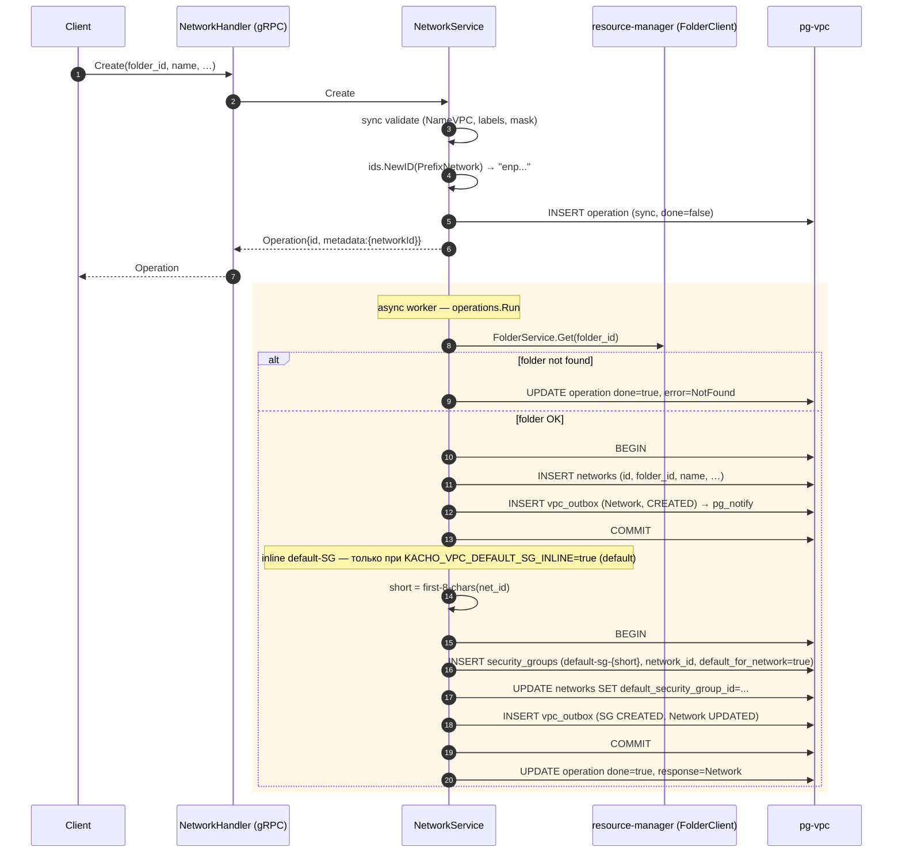
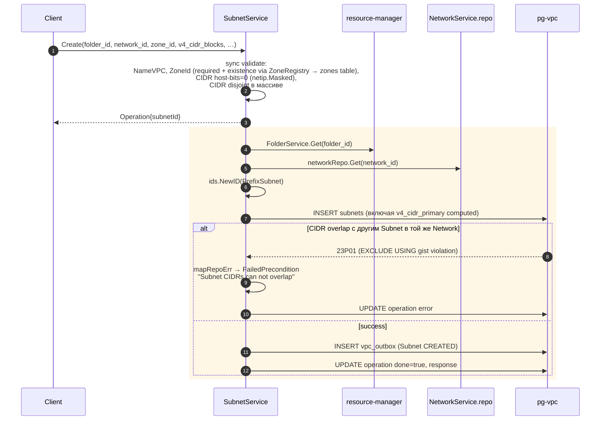
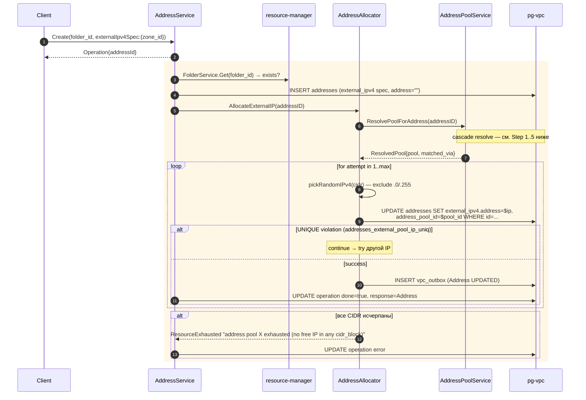
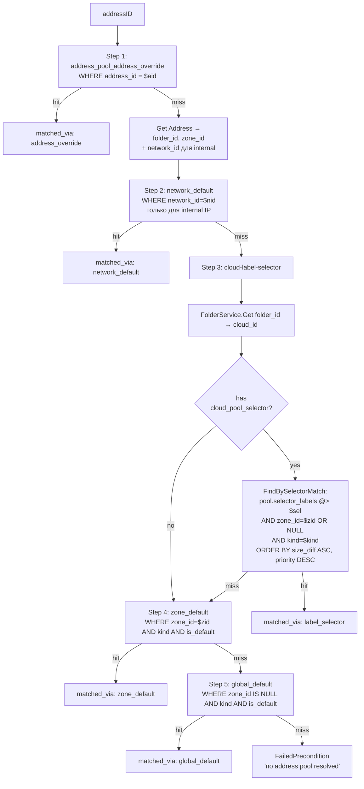
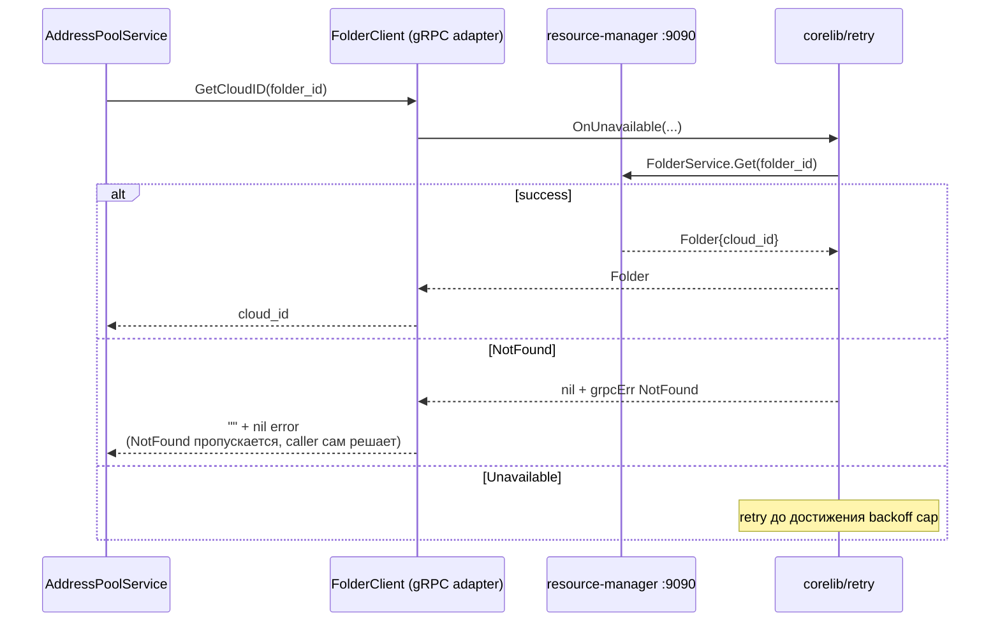
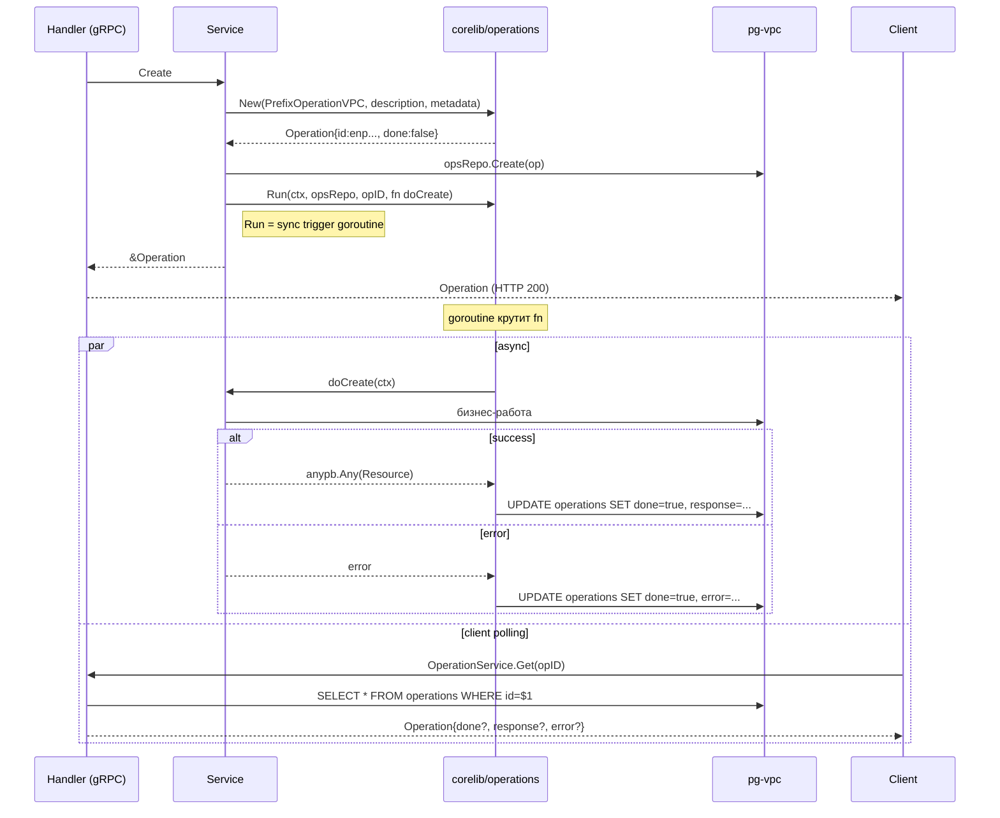
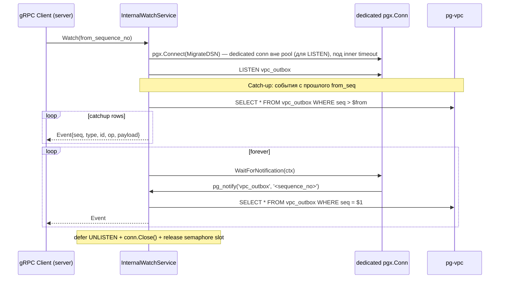
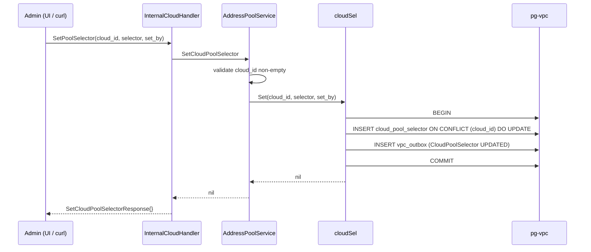

# 02 — Data Flows

Sequence-диаграммы реальных VPC-сценариев (то что **в коде**).

## Содержание

1. [Network create + inline default-SG](#1-network-create--inline-default-sg)
2. [Subnet create + CIDR overlap protection](#2-subnet-create--cidr-overlap-protection)
3. [Address allocate cascade (external)](#3-address-allocate-cascade-external)
4. [Address allocate (internal IP в Subnet)](#4-address-allocate-internal-ip-в-subnet)
5. [Cross-service: folder → cloud_id lookup](#5-cross-service-folder--cloud_id-lookup)
6. [Operations LRO worker](#6-operations-lro-worker)
7. [InternalWatchService outbox stream](#7-internalwatchservice-outbox-stream)
8. [Admin: set CloudPoolSelector](#8-admin-set-cloudpoolselector)

---

## 1. Network create + inline default-SG



Особенности:
- Раньше default-SG создавал отдельный `kacho-vpc-controllers` reconciler-loop, наблюдая outbox. **В Phase 2 упразднён** — теперь inline в worker'е, если `KACHO_VPC_DEFAULT_SG_INLINE=true` (default). При `=false` шаги 5-9 на диаграмме (default-SG TX) пропускаются.
- Mapping: `ALREADY_EXISTS` на `networks_folder_id_name_key` UNIQUE(folder_id, name). Для остальных 6 ресурсов аналогичный UNIQUE добавлен миграцией `0002_resource_name_unique.sql` (partial, `WHERE name <> ''`).

---

## 2. Subnet create + CIDR overlap protection



EXCLUDE constraint (`subnets_no_overlap_v4`) проверяет только
`v4_cidr_primary` (array[0]). Для `AddCidrBlocks` второй+ CIDR — защита
сервис-level (см. `subnet.go:382-388`).

---

## 3. Address allocate cascade (external)

Главный нетривиальный flow. Подробнее в [`03-ipam.md`](03-ipam.md).



### Cascade resolve внутри `POOL.ResolvePoolForAddress`



Match-семантика inverse-containment: `cloud_selector ⊆ pool.selector_labels` (pool описывает whitelist; cloud — подмножество).

---

## 4. Address allocate internal IP в Subnet

То же что external, но:
- Spec: `internal_ipv4_address_spec.subnet_id`.
- Cascade: пропускаются Step 1, 2 — IP берётся из CIDR Subnet, никакого pool'а.
- UNIQUE: `(internal_subnet_id, address)` — нельзя повторить IP в той же Subnet.

```mermaid
sequenceDiagram
  participant AS as AddressService
  participant ALC as AddressAllocator
  participant SUB as SubnetRepo
  participant DB as pg-vpc

  AS->>ALC: AllocateInternalIP(addressID)
  ALC->>SUB: Get(subnet_id) → cidr_blocks
  loop attempt in 1..max
    ALC->>ALC: pickRandomIPv4(cidr) — exclude .0/.255 + reserved (.1?)
    ALC->>DB: UPDATE addresses SET internal_ipv4.address=$ip
    alt UNIQUE violation
      continue
    else success
      ALC->>DB: INSERT vpc_outbox (Address UPDATED)
    end
  end
```

---

## 5. Cross-service: folder → cloud_id lookup

Единственная межсервисная зависимость VPC. Используется в IPAM cascade
Step 3 (cloud-pool-selector).



`FolderClient` не сообщает NotFound — возвращает empty cloud_id. Caller
(cascade) сам трактует empty как "skip step".

---

## 6. Operations LRO worker

Шаблон для всех мутаций (Create/Update/Delete/Move/AddCidrBlocks/...).



Worker — на той же поде, что сервис. Если pod крашится — операция
остаётся в `done=false` навсегда (TODO: heartbeat / cleanup).

---

## 7. InternalWatchService outbox stream

Server-to-server. UI/TUI/CLI **не используют** (полят).



Триггер `vpc_outbox_notify_trg` на INSERT шлёт `pg_notify`. Без этого
триггера watch будет догонять только при следующем catch-up.

---

## 8. Admin: set CloudPoolSelector

Admin переключает cloud на премиум-pool.



Effect: следующий `AllocateExternalIP` для **любого** Address из folder этого Cloud попадёт в cascade Step 3 с этим selector.

---

## Где смотреть исходник

| Поток | Код |
|---|---|
| Network create + default-SG | `internal/service/network.go::doCreate` |
| Subnet create + CIDR | `internal/service/subnet.go::doCreate` |
| Address create | `internal/service/address.go::doCreate` |
| Cascade resolve | `internal/service/address_pool_service.go::resolveWithRunnerUp` |
| AllocateExternalIP retry-loop | `internal/service/address.go::AllocateExternalIP` (аллокатор inlined из бывшего `address_allocate.go`) |
| `isUniqueViolation` / двухфазный sweep | `internal/service/address.go` (бенчмарки — `address_allocate_bench_test.go`) |
| FolderClient.GetCloudID | `internal/clients/resourcemanager_client.go` |
| Operations worker | `kacho-corelib/operations/run.go` |
| Outbox + LISTEN/NOTIFY | `internal/handler/internal_watch_handler.go` |
