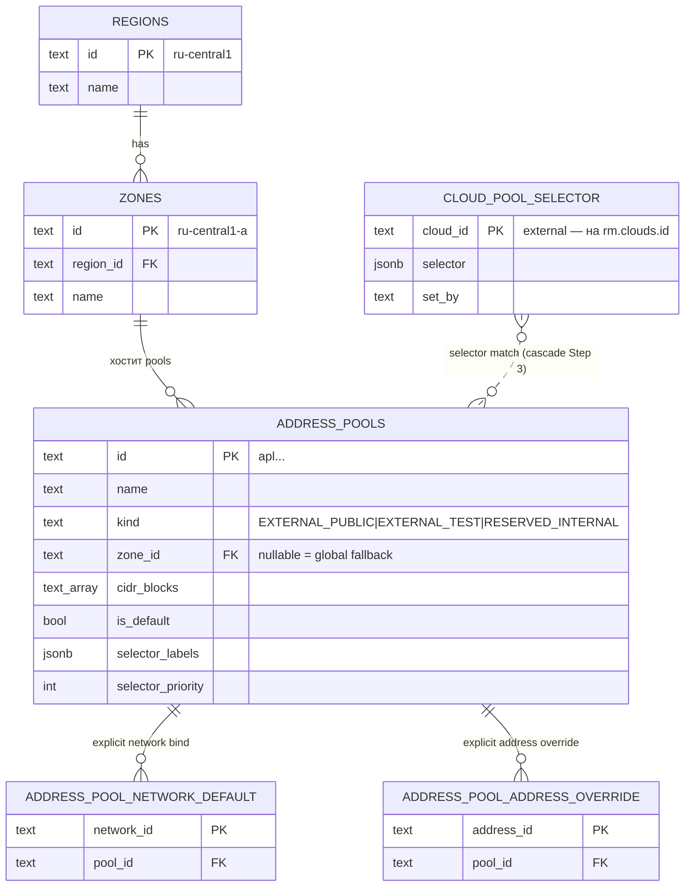
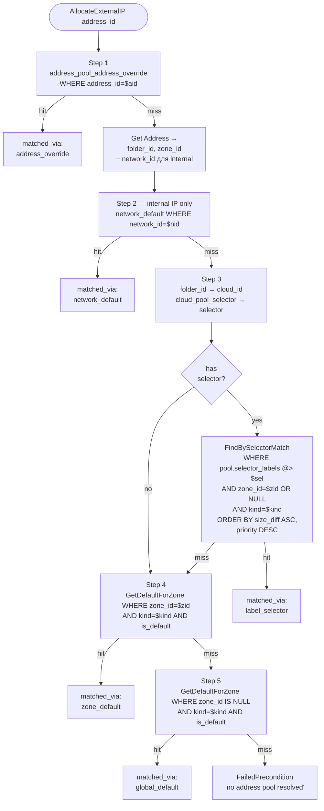

# 03 — IPAM Model (kacho-vpc)

Главная нетривиальная фича VPC. **Полностью kacho-only** — в YC такого
разделения регион/зона/пул на admin-уровне нет.

## Сущности



## Две иерархии (важный концепт)

```
КЛИЕНТСКАЯ                            СИСТЕМНАЯ
───────────                            ─────────
Organization ─ kacho-resource-mgr      (no parent)
   └─ Cloud   ─ kacho-resource-mgr     Region (admin)
        └─ Folder ◄────────┐              └─ Zone (admin)
              └─ Network    │                   └─ AddressPool (admin)
                  └─ Subnet │                        │
                       └─ Address (internal)         │
                                                     │
              └─ Address (external) ◄────────────────┘
                  external_ipv4.address_pool_id

              └─ CloudPoolSelector ──┐
                 (admin labels на     │ влияет
                  клиентский Cloud)   ▼
                            cascade Step 3
```

- **Клиентская** — verbatim YC (`kacho-resource-manager` + публичная VPC API).
- **Системная** — kacho-only, admin-managed. Pool/Region/Zone не принадлежат
  клиенту, но external IP клиента берёт оттуда.
- **Точка пересечения** — `Cloud`. На клиентском Cloud висит admin-управляемый
  `CloudPoolSelector` для cascade routing.

## Region / Zone

- Глобальные admin-only ресурсы. Нет folder/cloud/org.
- `region.id` — строка типа `ru-central1`, PK.
- `zone.id` — строка типа `ru-central1-a`, PK; FK на region (RESTRICT).
- `UNIQUE(region_id, name) WHERE name <> ''` — нельзя дубль-имена в одном
  регионе (миграция 0022).
- Seed: миграция 0019 — `ru-central1` + `ru-central1-{a,b,d}`.
- API: `InternalRegionService` / `InternalZoneService` (5 RPC каждый).

## AddressPool

- Глобальный admin-only ресурс. **Нет** `folder_id` (миграция 0021 убрала).
- `cidr_blocks TEXT[]` — массив IPv4 CIDR-блоков.
- `kind` — `EXTERNAL_PUBLIC | EXTERNAL_TEST | RESERVED_INTERNAL`.
- `zone_id` — FK на zones, **nullable**. NULL = глобальный fallback (cascade Step 5).
- `is_default` — partial UNIQUE: один `is_default=true` на `(COALESCE(zone_id,''), kind)` — миграция 0020.
- `selector_labels JSONB`, `selector_priority INT` — для cascade Step 3.
- `addresses_external_pool_ip_uniq` — partial UNIQUE на `(address_pool_id, address)` в `addresses` — гарантия что один IP не выделится дважды.

## CloudPoolSelector

- kacho-only. Хранится в **kacho-vpc.cloud_pool_selector** (миграция 0022).
- PK = `cloud_id` (foreign — указывает на rm.clouds, кросс-DB FK нет;
  валидация через FolderClient на момент Set).
- `selector JSONB` + `set_by`, `set_at` (audit).
- GIN индекс `cloud_pool_selector_gin` на `selector jsonb_path_ops` для
  быстрых `@>`-запросов в cascade.
- Раньше был `network_pool_selector` — выпилили миграцией 0022. Причина:
  external Address не имеет network_id и cascade Step 3 никогда не
  срабатывал. Перевешивание на Cloud решает обе категории (external + internal).

## Bindings

`address_pool_network_default(network_id PK, pool_id)`:
- Cascade Step 2 (только internal IP path — у external нет network_id).
- API: `BindAsNetworkDefault / UnbindNetworkDefault`.

`address_pool_address_override(address_id PK, pool_id)`:
- Cascade Step 1 (override на конкретный Address).
- Применим только если у Address ещё нет allocated IP.
- API: `BindAsAddressOverride / UnbindAddressOverride`.

## Cascade resolve

Используется в `AddressAllocator.AllocateExternalIP`.
Вход: `address_id`. Выход: `pool` (или `FailedPrecondition`).



## Match семантика

**Inverse-containment**: `cloud_selector ⊆ pool.selector_labels` (pool описывает **whitelist разрешённых labels**). Если у cloud есть label, не упомянутый в pool → она **не** match'ается. Это safe-by-default — новая комбинация labels уйдёт в default-pool, а не в премиум.

| pool.selector_labels | cloud-selector | match |
|---|---|---|
| `{tier:premium}` | `{tier:premium}` | ✅ |
| `{tier:premium}` | `{tier:premium, customer:acme}` | ❌ (customer не упомянут в pool) |
| `{tier:premium, customer:acme}` | `{tier:premium}` | ✅ (cloud ⊆ pool) |
| `{tier:premium, customer:acme}` | `{tier:premium, customer:acme, env:prod}` | ❌ (env не упомянут) |

`@>` в Postgres jsonb — точно эта семантика: `pool.labels @> $cloud_labels` true когда `pool.labels` содержит **все** ключи `cloud_labels` с теми же значениями.

## Tie-break при equal-specificity и equal-priority

ORDER BY:
1. `(size(pool.selector_labels) - size(cloud_selector)) ASC` — точнее лучше.
2. `selector_priority DESC` — выше = wins.

При equal-equal: **resolve order undefined** — Postgres вернёт первую row. Для обнаружения ambiguous конфигов — `InternalAddressPoolService.Check` (`GET /vpc/v1/addressPools:check`).

## IP picker

`AddressAllocator.AllocateExternalIP` после resolve:

```
for attempt in 1..maxAttempts:
  for cidr in pool.cidr_blocks:
    ip = pickRandomIPv4(cidr)         # exclude .0/.broadcast
    err = addrRepo.SetIPSpec(addressID, {address:ip, pool_id:pool.id})
    if isUniqueViolation(err):
      continue                         # try другой IP
    return result, err
return ResourceExhausted "address pool X exhausted (no free IP in any cidr_block)"
```

`isUniqueViolation` распознаёт **обе** формы:
- raw pgErr (substring `SQLSTATE 23505` / `addresses_external_pool_ip_uniq`)
- обёртку `service.ErrAlreadyExists` (через `errors.Is`)

Без второй ветки `wrapPgErr` в `SetIPSpec` ломал retry-loop и наружу шёл raw "already exists" вместо `ResourceExhausted`.

## Utilization (admin observability)

`InternalAddressPoolService.GetUtilization(pool_id)`:

```json
{
  "poolId": "apl...",
  "totalIps": "510",
  "usedIps": "127",
  "freeIps": "383",
  "usedPercent": 24,
  "cidrs": [
    {"cidr":"198.51.100.0/24", "total":254, "used":120},
    {"cidr":"203.0.113.0/24",  "total":254, "used":7}
  ]
}
```

- `total` per CIDR = `2^(32-bits) - 2` (исключая network/broadcast). Для /31 = 2 (RFC 3021), /32 = 1.
- `used` per CIDR — Postgres `address::inet << cidr` подсчёт.

REST: `GET /vpc/v1/addressPools/{pool_id}/utilization` (через apiGW, на cluster-internal listener).

## Управление (через api-gateway internal mux — нет CLI)

Отдельного `kachoctl-ipam` CLI **нет** (удалён) — все admin-операции делаются
REST-запросами на cluster-internal listener api-gateway (локально — port-forward
на `localhost:18080`) либо из web-UI. Эти пути не публикуются на external TLS endpoint.

```bash
BASE=http://localhost:18080   # port-forward api-gateway

# Region / Zone — InternalRegionService / InternalZoneService
curl -XPOST $BASE/vpc/v1/regions -d '{"id":"eu-west1","name":"Europe West 1"}'
curl -XPOST $BASE/vpc/v1/zones   -d '{"id":"eu-west1-a","regionId":"eu-west1","name":"EUW1-A"}'

# AddressPool (глобальный — без folder_id) — InternalAddressPoolService.Create
curl -XPOST $BASE/vpc/v1/addressPools -d \
  '{"name":"default-zone-a","kind":"EXTERNAL_PUBLIC","zoneId":"ru-central1-a","cidrBlocks":["198.51.100.0/24"],"isDefault":true}'
curl -XPOST $BASE/vpc/v1/addressPools -d \
  '{"name":"premium-pool","kind":"EXTERNAL_PUBLIC","zoneId":"ru-central1-a","cidrBlocks":["203.0.113.0/24"],"selectorLabels":{"tier":"premium"},"selectorPriority":100}'

# Cloud-selector (cascade Step 3) — InternalCloudService.SetPoolSelector;
# либо явная привязка addressPoolBinding (per-network) / addressPoolOverride (per-address)
curl -XPOST $BASE/vpc/v1/clouds/b1g.../poolSelector -d '{"selector":{"tier":"premium"},"setBy":"admin@kacho"}'
curl -XPOST $BASE/vpc/v1/networks/enp.../addressPoolBinding -d '{"poolId":"apl..."}'
curl -XPOST $BASE/vpc/v1/addresses/e9b.../addressPoolOverride -d '{"poolId":"apl..."}'

# Diagnostics — InternalAddressPoolService.{Check,ExplainResolution}
curl "$BASE/vpc/v1/addressPools:check?zoneId=ru-central1-a"
curl "$BASE/vpc/v1/addressPools:explainResolution?addressId=e9b...&networkId=enp..."
```

## Ошибки

| Ситуация | gRPC code | Текст |
|---|---|---|
| Все 5 шагов не дали pool | `FailedPrecondition` | `"no address pool resolved for address X (network Y)"` |
| Pool найден, но все CIDR исчерпаны | `ResourceExhausted` | `"address pool X exhausted (no free IP in any cidr_block)"` |
| `BindAsAddressOverride` на уже-allocated IP | `FailedPrecondition` | `"address X already has allocated external IP \"...\""` |
| `zone_id` не существует (FK violation на pool create) | `FailedPrecondition` | (общая обёртка от mapPoolErr) |

Подробно про ошибки — в [`06-conventions.md`](06-conventions.md).
