# ER-diagram — `kacho_vpc` schema (KAC-98)

> **Источник**: `internal/migrations/0001_initial.sql` (squashed baseline) + delta-migrations
> `0002…0034`. Делается под Skill `evgeniy §5 E.6` (ER-диаграмма обязательна для каждого
> сервиса). Парная документация — `within-service-refs-audit.md` (KAC-84), которая аудитит,
> что каждая ссылка / инвариант покрыты DB-уровнем (FK / UNIQUE / EXCLUDE / CHECK / CAS).
>
> Схема — `kacho_vpc` (skill `evgeniy §5 E.4`, миграция `0034_schema_rename_to_kacho_vpc.sql`
> — KAC-94, PR #80): все 20 user-таблиц + `goose_db_version` + 5 user-функций
> (`kacho_labels_valid` + 4 trigger-функции) живут в `kacho_vpc.*`. До PR #80 schema была
> `public` — этот документ ссылается на новые qualified-имена. Extension `btree_gist`
> остаётся в `public` (extension-owned). Search_path: `kacho_vpc, public` —
> устанавливается через libpq-параметр `options=-c search_path=kacho_vpc,public` в
> `config.baseDSN()`. Все id-колонки — `TEXT` (3-char crockford-base32 prefix + 17 chars;
> см. workspace `CLAUDE.md §E.7` + `kacho-vpc/CLAUDE.md §3`).
>
> См. также: `kacho-vpc/CLAUDE.md §2` (Доменная модель и связи), `01-resources.md`
> (poле-by-поле описание ресурсов), `03-ipam.md` (IPAM cascade), `05-database.md`
> (миграции / индексы прочие).

---

## Mermaid ER

```mermaid
erDiagram
  NETWORKS {
    text id PK
    text folder_id "FK → resource-manager.folders.id (cross-service, no FK)"
    text name "UNIQUE (folder_id, name)"
    text description
    jsonb labels
    text default_security_group_id "soft-ref → security_groups (no FK; cleared inline)"
    text route_distinguisher
    timestamptz created_at
  }

  SUBNETS {
    text id PK
    text folder_id
    text name "partial UNIQUE (folder_id, name) WHERE name<>''"
    text description
    jsonb labels
    text network_id "FK → networks.id (no ON DELETE clause = NO ACTION/RESTRICT)"
    text zone_id "cross-service ref → compute.zones (no FK after KAC-15)"
    text_array v4_cidr_blocks
    text_array v6_cidr_blocks
    text route_table_id "FK → route_tables.id ON DELETE SET NULL (mig 0019)"
    jsonb dhcp_options
    cidr v4_cidr_primary "GENERATED STORED from v4_cidr_blocks[1]"
    cidr v6_cidr_primary "GENERATED STORED from v6_cidr_blocks[1]"
    timestamptz created_at
  }

  ADDRESSES {
    text id PK
    text folder_id
    text name "partial UNIQUE (folder_id, name) WHERE name<>''"
    text description
    jsonb labels
    smallint addr_type
    smallint ip_version
    bool reserved
    bool used
    bool deletion_protection
    jsonb external_ipv4
    jsonb external_ipv6
    jsonb internal_ipv4
    jsonb internal_ipv6
    text internal_subnet_id "GENERATED STORED from internal_ipv4|v6->>subnet_id; FK→subnets.id ON DELETE RESTRICT"
    timestamptz created_at
  }

  ADDRESS_REFERENCES {
    text address_id PK "FK → addresses.id ON DELETE CASCADE"
    text referrer_type
    text referrer_id
    text referrer_name
    timestamptz attached_at
  }

  NETWORK_INTERFACES {
    text id PK
    text folder_id
    text name "partial UNIQUE (folder_id, name) WHERE name<>''"
    text description
    jsonb labels
    text subnet_id "FK → subnets.id ON DELETE RESTRICT (mig 0012)"
    jsonb v4_address_ids "CHECK jsonb_array_length(v4_address_ids) <= 1 (mig 0018)"
    jsonb v6_address_ids "CHECK jsonb_array_length(v6_address_ids) <= 1 (mig 0018)"
    jsonb security_group_ids
    text used_by_type
    text used_by_id "atomic CAS, no partial UNIQUE (mig 0017 dropped it)"
    text used_by_name
    text mac_address "UNIQUE cloud-wide (mig 0014)"
    text status
    timestamptz created_at
  }

  ROUTE_TABLES {
    text id PK
    text folder_id
    text name "partial UNIQUE (folder_id, name) WHERE name<>''"
    text description
    jsonb labels
    text network_id "FK → networks.id (NO ACTION; service prevents Network.Delete via service-level guards)"
    jsonb static_routes
    timestamptz created_at
  }

  SECURITY_GROUPS {
    text id PK
    text folder_id
    text name "partial UNIQUE (folder_id, name) WHERE name<>''"
    text description
    jsonb labels
    text network_id "NULLABLE since mig 0010; FK → networks.id ON DELETE RESTRICT (when not NULL)"
    text status
    bool default_for_network
    jsonb rules
    timestamptz created_at
  }

  GATEWAYS {
    text id PK
    text folder_id
    text name "partial UNIQUE (folder_id, name) WHERE name<>''"
    text description
    jsonb labels
    text gateway_type
    timestamptz created_at
  }

  PRIVATE_ENDPOINTS {
    text id PK
    text folder_id
    text name "partial UNIQUE (folder_id, name) WHERE name<>''"
    text description
    jsonb labels
    text network_id "FK → networks.id ON DELETE RESTRICT (mig 0024, KAC-89)"
    text subnet_id "FK → subnets.id ON DELETE RESTRICT, NULL if unset (mig 0024)"
    text address_id "FK → addresses.id ON DELETE RESTRICT, NULL if unset (mig 0024)"
    text ip_address
    text service_type "CHECK enum {object_storage}|NULL (mig 0031)"
    jsonb dns_options
    text status "CHECK enum {PENDING,AVAILABLE,DELETING}|NULL (mig 0031)"
    timestamptz created_at
  }

  ADDRESS_POOLS {
    text id PK
    text name
    text description
    jsonb labels
    text_array v4_cidr_blocks "split from cidr_blocks in mig 0022 (KAC-71)"
    text_array v6_cidr_blocks "split from cidr_blocks in mig 0022 (KAC-71)"
    smallint kind
    bool is_default "partial UNIQUE (COALESCE(zone_id,''), kind) WHERE is_default"
    jsonb selector_labels "GIN index where labels<>'{}'"
    int selector_priority
    text zone_id "cross-service ref → compute.zones (FK dropped in mig 0004)"
    timestamptz created_at
    timestamptz modified_at
  }

  ADDRESS_POOL_ADDRESS_OVERRIDE {
    text address_id PK "FK → addresses.id ON DELETE CASCADE"
    text pool_id "FK → address_pools.id ON DELETE RESTRICT"
    timestamptz bound_at
  }

  ADDRESS_POOL_NETWORK_DEFAULT {
    text network_id PK "FK → networks.id ON DELETE CASCADE"
    text pool_id "FK → address_pools.id ON DELETE RESTRICT"
    timestamptz bound_at
  }

  ADDRESS_POOL_FREE_IPS {
    text pool_id PK "composite PK (pool_id, ip); FK → address_pools.id ON DELETE CASCADE"
    inet ip PK "composite PK (pool_id, ip)"
  }

  CLOUD_POOL_SELECTOR {
    text cloud_id PK "no FK (cross-service: clouds belong to resource-manager)"
    jsonb selector "GIN index where selector<>'{}'"
    text set_by
    timestamptz set_at
  }

  IPV6_POOL_CURSORS {
    text pool_id PK "FK → address_pools.id ON DELETE CASCADE"
    numeric next_offset "NUMERIC(39,0); fits 2^128"
  }

  IPV6_ALLOCATED_IPS {
    text pool_id PK "composite PK (pool_id, ip); FK → address_pools.id ON DELETE CASCADE; UNIQUE (pool_id, offset)"
    inet ip PK "composite PK (pool_id, ip)"
    numeric offset
    text address_id "no FK"
    timestamptz created_at
  }

  IPV6_RELEASED_OFFSETS {
    text pool_id PK "composite PK (pool_id, offset); FK → address_pools.id ON DELETE CASCADE"
    numeric offset PK "composite PK (pool_id, offset)"
  }

  OPERATIONS {
    text id PK
    text description
    text created_by
    bool done
    text metadata_type
    bytea metadata_data
    text resource_id
    int error_code
    text error_message
    bytea error_details
    text response_type
    bytea response_data
    timestamptz created_at
    timestamptz modified_at
  }

  VPC_OUTBOX {
    bigint sequence_no PK "DEFAULT nextval(vpc_outbox_sequence_no_seq)"
    text resource_kind
    text resource_id
    text event_type
    jsonb payload
    timestamptz created_at
    timestamptz processed_at
  }

  VPC_WATCH_CURSORS {
    text subscriber_id PK
    bigint last_sequence_no
    timestamptz updated_at
  }

  NETWORKS ||--o{ SUBNETS : "subnets.network_id (RESTRICT)"
  NETWORKS ||--o{ ROUTE_TABLES : "route_tables.network_id (RESTRICT)"
  NETWORKS ||--o{ SECURITY_GROUPS : "security_groups.network_id (RESTRICT, nullable)"
  NETWORKS ||--o{ ADDRESS_POOL_NETWORK_DEFAULT : "binding (CASCADE)"
  SUBNETS  ||--o{ NETWORK_INTERFACES : "network_interfaces.subnet_id (RESTRICT, mig 0012)"
  SUBNETS  ||--o{ ADDRESSES : "via addresses.internal_subnet_id GENERATED (RESTRICT, mig 0013)"
  ROUTE_TABLES ||--o{ SUBNETS : "subnets.route_table_id (SET NULL, mig 0019)"
  ADDRESSES ||--o| ADDRESS_REFERENCES : "address_id PK (CASCADE)"
  ADDRESSES ||--o| ADDRESS_POOL_ADDRESS_OVERRIDE : "address_id PK (CASCADE)"
  ADDRESS_POOLS ||--o{ ADDRESS_POOL_ADDRESS_OVERRIDE : "pool_id (RESTRICT)"
  ADDRESS_POOLS ||--o{ ADDRESS_POOL_NETWORK_DEFAULT : "pool_id (RESTRICT)"
  ADDRESS_POOLS ||--o{ ADDRESS_POOL_FREE_IPS : "pool_id (CASCADE)"
  ADDRESS_POOLS ||--o| IPV6_POOL_CURSORS : "pool_id PK (CASCADE)"
  ADDRESS_POOLS ||--o{ IPV6_ALLOCATED_IPS : "pool_id (CASCADE)"
  ADDRESS_POOLS ||--o{ IPV6_RELEASED_OFFSETS : "pool_id (CASCADE)"
  NETWORK_INTERFACES }o..o{ ADDRESSES : "v4_address_ids[] / v6_address_ids[] (soft-ref, no FK)"
  NETWORK_INTERFACES }o..o{ SECURITY_GROUPS : "security_group_ids[] (soft-ref, no FK)"
  SECURITY_GROUPS }o..o| NETWORKS : "default_security_group_id (soft-ref, no FK)"
  NETWORKS  ||--o{ PRIVATE_ENDPOINTS : "private_endpoints.network_id (RESTRICT, mig 0024)"
  SUBNETS   ||--o{ PRIVATE_ENDPOINTS : "private_endpoints.subnet_id (RESTRICT, mig 0024)"
  ADDRESSES ||--o{ PRIVATE_ENDPOINTS : "private_endpoints.address_id (RESTRICT, mig 0024)"
```

---

## Таблицы — описание и DB-level гарантии

### Public ресурсы (folder-scoped, в верстабельной части ER)

#### `networks`
Контейнер VPC. PK `id` (`enp…`). UNIQUE `(folder_id, name)` non-partial (миграция 0001 baseline). `default_security_group_id` — soft-ссылка на одну из `security_groups` той же сети, без FK (выставляется inline в `network.go::doCreate` при `KACHO_VPC_DEFAULT_SG_INLINE=true`). **Note**: миграция 0023 (KAC-79) убрала колонку `vpn_id` + sequence `vpn_id_seq` + freelist `vpn_id_free` после перехода на kube-ovn — раньше это был internal-only 24-bit data-plane id, не в публичной проекции `Network`.

#### `subnets`
Подсеть в Network. UNIQUE `(folder_id, name) WHERE name<>''` (миграция 0002). FK `network_id → networks(id)` (NO ACTION = блокирует удаление Network с детьми). FK `route_table_id → route_tables(id) ON DELETE SET NULL` (миграция 0019, KAC-56). **EXCLUDE-constraints** (миграция 0001 baseline):
- `subnets_no_overlap_v4`: `EXCLUDE USING gist (network_id WITH =, v4_cidr_primary inet_ops WITH &&) WHERE (v4_cidr_primary IS NOT NULL)`.
- `subnets_no_overlap_v6`: симметрично для v6.

Generated columns: `v4_cidr_primary`, `v6_cidr_primary` — STORED `cidr`, выводимое из первого элемента массива при условии regex-match. Используются исключительно EXCLUDE-constraint'ами (host-bits validation остаётся на service-слое — `validateCIDRPrefix`).

**Auto-association с RouteTable** (миграция 0019, PL/pgSQL triggers):
- `rt_auto_assoc_subnets_trg` (AFTER INSERT ON route_tables) — выставляет `route_table_id` на subnets с `route_table_id IS NULL` в той же сети.
- `subnet_auto_pick_rt_trg` (BEFORE INSERT ON subnets) — заполняет `NEW.route_table_id` самой ранней RT этой сети, если клиент не задал.
- `subnets_outbox_emit_route_table_change_trg` (AFTER UPDATE OF route_table_id) — эмитит `Subnet.UPDATED` в `vpc_outbox` (с `auto_association: true` payload).

#### `addresses`
IP-ресурс (external / internal, v4 / v6). UNIQUE `(folder_id, name) WHERE name<>''` (миграция 0002).

**Generated column `internal_subnet_id`** (миграция 0001 baseline → 0013): STORED TEXT, выводится из `internal_ipv4->>'subnet_id'` ИЛИ `internal_ipv6->>'subnet_id'` (расширение в 0013, KAC-34). FK `addresses_internal_subnet_fkey → subnets(id) ON DELETE RESTRICT` (через эту generated-колонку). Этот мостик заменяет «software-precheck: subnet с адресами не удаляется» атомарной DB-гарантией.

**Partial UNIQUE indexes:**
- `addresses_external_ip_uniq`: UNIQUE `(external_ipv4->>'address') WHERE external_ipv4 IS NOT NULL AND … <> ''` — глобальная уникальность IPv4 в external-аллокации.
- `addresses_external_pool_ip_uniq`: UNIQUE `(external_ipv4->>'address_pool_id', external_ipv4->>'address')` — per-pool dedup (conflict-target для IPv4 allocator).
- `addresses_external_v6_pool_ip_uniq` (миграция 0021, KAC-60): аналог для IPv6.
- `addresses_internal_subnet_ip_uniq`: UNIQUE `(internal_ipv4->>'subnet_id', internal_ipv4->>'address')` — per-subnet dedup IPv4.
- `addresses_internal_subnet_ipv6_uniq` (миграция 0009): тот же контракт для IPv6.

#### `address_references`
Один-к-одному backref «кто использует адрес». PK `address_id`, FK → `addresses(id) ON DELETE CASCADE`. Service-слой синхронно проставляет/снимает referrer-row в TX с изменением `addresses.used`. См. CLAUDE.md §2.1 (NIC), §16.

#### `network_interfaces`
First-class AWS-ENI-style ресурс (эпик KAC-2). UNIQUE `(folder_id, name) WHERE name<>''`. UNIQUE `mac_address` cloud-wide (миграция 0014, KAC-48). FK `subnet_id → subnets(id) ON DELETE RESTRICT` (миграция 0012 откатила KAC-31's CASCADE — NIC жёстко блокирует свою подсеть).

**CHECK-constraints** (миграция 0018, KAC-55):
- `network_interfaces_v4_addr_max1`: `CHECK (jsonb_array_length(v4_address_ids) <= 1)`.
- `network_interfaces_v6_addr_max1`: симметрично v6.

Multi-IP на VM выражается через несколько NIC (а не secondary addresses в одном NIC). Soft-refs `v4_address_ids[]` / `v6_address_ids[]` / `security_group_ids[]` хранятся jsonb-массивами **без FK** — invariant «адрес ≤ 1 NIC» обеспечивается service-слоем через `addresses.used` + `address_references` (NIC-attach pattern идентичен Address.referrer pattern). `used_by_id` (кто приаттачил NIC, обычно Compute.Instance) меняется через **atomic CAS** `UPDATE … WHERE id=$1 AND (used_by_id='' OR used_by_id=$3) RETURNING …` — partial UNIQUE на `(used_by_id) WHERE used_by_id<>''` был добавлен в 0016 и **дропнут в 0017** (KAC-52 follow-up: семантически неверен — запрещал multi-NIC instance).

**Note**: миграция 0023 (KAC-79) убрала data-plane проекцию (`hv_id`, `sid`, `sid_seq`, `host_iface`, `netns`, `gateway_ip`, `container_id`, `status_error`, `dataplane_revision`, `dataplane_updated_at`) — после перехода на kube-ovn эти поля больше не нужны.

#### `route_tables`
RouteTable folder-level. UNIQUE `(folder_id, name) WHERE name<>''`. FK `network_id → networks(id)` (NO ACTION).

#### `security_groups`
SG folder-level. UNIQUE `(folder_id, name) WHERE name<>''`. FK `network_id → networks(id) ON DELETE RESTRICT` — **колонка nullable с миграции 0010** (kacho-proto#8: SG без привязки к сети — global / folder-level / unbound; пустая строка в домене хранится как NULL чтобы FK не срабатывал). `rules` — jsonb-массив (service-level validation).

#### `gateways`, `private_endpoints`
Folder-level. `gateways` — без cross-resource FK (`gateway_type` пока единственное domain-поле; будущие attachment'ы — отдельные таблицы).

`private_endpoints` (миграция 0024, KAC-89): within-service refs `network_id`/`subnet_id`/`address_id` теперь FK ON DELETE RESTRICT (раньше — software-only soft-ref, нарушало запрет workspace #10). `subnet_id`/`address_id` nullable (PG MATCH SIMPLE пропускает NULL; миграция нормализует `''` → NULL). Default-SG-style cascade не используется — Network/Subnet/Address с PE удалить нельзя без явного удаления PE. CHECK constraints (миграция 0031): `service_type ∈ {object_storage}` либо NULL; `status ∈ {PENDING, AVAILABLE, DELETING}` либо NULL.

---

### IPAM / Address Pools (admin-only, internal API)

#### `address_pools`
Глобальный admin-ресурс (kacho-only, не в verbatim YC). PK `id` (`apl…`). `v4_cidr_blocks` + `v6_cidr_blocks` (text[]) — split на family с миграции 0022 (KAC-71; раньше был общий `cidr_blocks`). FK `zone_id` к `zones` **дропнут в 0004** (KAC-15 Geography → kacho-compute): теперь `zone_id` — soft-ссылка на `kacho-compute.zones`, валидируется на request-path через `compute.v1.ZoneService.Get`.

**Partial UNIQUE:** `address_pools_zone_kind_default_uniq` `(COALESCE(zone_id,''), kind) WHERE is_default = true` — ровно один default-pool per (zone, kind). **GIN** `address_pools_selector_labels_gin (selector_labels jsonb_path_ops) WHERE selector_labels <> '{}'` — быстрые `@>` containment-запросы в IPAM cascade Step 3.

#### `address_pool_address_override`, `address_pool_network_default`
Explicit overrides для IPAM cascade. PK на referenced-ресурсе (address_id / network_id). FK CASCADE на референсируемом ресурсе (Address.Delete / Network.Delete авточистит override), FK RESTRICT на pool_id (нельзя удалить pool, на который ссылается override — admin должен сначала пересоздать override).

#### `address_pool_free_ips`
Материализованный freelist IPv4 (миграция 0015): atomic SKIP LOCKED pop вместо random-pick-and-retry. PK `(pool_id, ip)`. FK `pool_id → address_pools(id) ON DELETE CASCADE`. Backfill в той же миграции — рекурсивный CTE по `cidr_blocks` с family=4, исключая network/broadcast и уже выданные IP.

#### `cloud_pool_selector`
Cloud-level routing-labels (admin-controlled). PK `cloud_id`. **`cloud_id` — cross-service ссылка на resource-manager.clouds** → FK невозможен (запрет workspace #8 — database-per-service). GIN `cloud_pool_selector_gin (selector jsonb_path_ops) WHERE selector <> '{}'`.

#### `ipv6_pool_cursors`, `ipv6_allocated_ips`, `ipv6_released_offsets`
Sparse counter-based IPAM для IPv6 (миграция 0021, KAC-60). Материализованный freelist на /64 нерабочий (18 квинтиллионов адресов). Схема:
- `ipv6_pool_cursors (pool_id PK, next_offset NUMERIC(39,0))` — fresh-allocator cursor; FK CASCADE.
- `ipv6_allocated_ips (pool_id, ip, offset, address_id, created_at)` PK `(pool_id, ip)` + UNIQUE `(pool_id, offset)`.
- `ipv6_released_offsets (pool_id, offset)` PK `(pool_id, offset)` — переиспользуемые offset'ы; `FOR UPDATE SKIP LOCKED` pop в Allocate.

---

### Operations / Outbox (corelib-стиль, per-service)

#### `operations`
Long-running async operations (corelib schema; включена в baseline 0001). PK `id` (`enp…`, `PrefixOperationVPC == PrefixNetwork`). Индексы по `done`, `created_at`, `resource_id`. Без FK на ресурсы (resource_id хранится как plain TEXT — resource может быть удалён до завершения op).

#### `vpc_outbox`
Транзакционный outbox. PK `sequence_no BIGINT` (DEFAULT `nextval(vpc_outbox_sequence_no_seq)`). Trigger `vpc_outbox_notify_trg` AFTER INSERT → `pg_notify('vpc_outbox', NEW.sequence_no::text)`. `InternalWatchService` использует dedicated pgx-conn вне pool с `LISTEN vpc_outbox`.

#### `vpc_watch_cursors`
Per-subscriber cursor для LISTEN/NOTIFY restart-сценария. PK `subscriber_id`.

---

## Связи через границу сервиса (cross-service, **software-validated, no FK**)

> Workspace `CLAUDE.md` §«Кросс-доменные ссылки на ресурсы» / запрет #8 — database-per-service запрещает cross-DB FK. Ссылки в этом списке хранятся как `TEXT` колонки и валидируются gRPC-вызовом owner-сервиса в worker'е Create/Update; на чтении переживается dangling-ref.

| Колонка                                       | Owner-сервис             | Owner-метод                                | ON DELETE-симуляция         |
|-----------------------------------------------|--------------------------|--------------------------------------------|------------------------------|
| `networks.folder_id`                          | `kacho-resource-manager` | `FolderService.Exists`                     | n/a (validate-on-write only) |
| `subnets.folder_id` / `.zone_id`              | RM / `kacho-compute`     | `FolderService.Exists` / `ZoneService.Get` | n/a                          |
| `addresses.folder_id`                         | RM                       | `FolderService.Exists`                     | n/a                          |
| `addresses.external_ipv4->>'zone_id'`         | `kacho-compute`          | `ZoneService.Get`                          | n/a (graceful dangling)      |
| `addresses.external_ipv6->>'zone_id'`         | `kacho-compute`          | `ZoneService.Get`                          | n/a (graceful dangling)      |
| `address_pools.zone_id`                       | `kacho-compute`          | `ZoneService.Get`                          | n/a                          |
| `network_interfaces.used_by_id`               | varies (typically `kacho-compute.instances`) | (no peer call; tenant-facing reference) | n/a (denormalized mirror) |
| `cloud_pool_selector.cloud_id`                | RM (Cloud)               | `CloudService.Get`                         | n/a                          |
| `route_tables.folder_id` / `security_groups.folder_id` / `gateways.folder_id` / `private_endpoints.folder_id` / `network_interfaces.folder_id` | RM | `FolderService.Exists` | n/a |

`subnets.route_table_id` — **внутри одной БД**, FK ON DELETE SET NULL (миграция 0019, не cross-service).

---

## DB-level CHECK-constraints (Wave 2, миграции 0025–0033)

Все 8 публичных VPC-ресурсов (`networks`, `subnets`, `addresses`, `route_tables`, `security_groups`, `gateways`, `private_endpoints`, `network_interfaces`) имеют DB-level CHECK constraints поверх `domain.Validate` (skill `evgeniy §5 E.1/E.2` — «БД — последний рубеж от внешних writers / bugs в app-коде»):

- **name** (миграции 0025–0032): regex `^([a-zA-Z]([-_a-zA-Z0-9]{0,61}[a-zA-Z0-9])?)?$` (verbatim YC permissive, 0–63 байт, allowed empty/uppercase/underscore).
- **description** (миграции 0025–0032): `length(description) ≤ 256` (UTF-8 character count).
- **status** (миграции 0029/0031/0032): enum-проверка — SG `{ACTIVE,CREATING,UPDATING,DELETING}`; PE `{PENDING,AVAILABLE,DELETING}|NULL`; NIC `{PROVISIONING,ACTIVE,AVAILABLE,FAILED,DELETING,STATUS_UNSPECIFIED}|NULL`.
- **service_type** (миграция 0031, PE): `{object_storage}|NULL`.
- **mac_address** (миграция 0032, NIC): regex `^[0-9a-f]{2}(:[0-9a-f]{2}){5}$` (lowercase, colon-separated; legacy md5-backfill отбивается, см. 0014).
- **labels** (миграция 0033, все 8 ресурсов): `CHECK (kacho_labels_valid(labels))` — helper-функция `kacho_vpc.kacho_labels_valid(jsonb) IMMUTABLE` проверяет cardinality ≤ 64, key regex `^[a-z][-_./\\@a-z0-9]{0,62}$`, value length ≤ 63.

Все эти constraint'ы маппятся через `wrapPgErr` (SQLSTATE `23514`) в `service.ErrInvalidArg` → gRPC `INVALID_ARGUMENT`. Defensive RAISE EXCEPTION P0001 в каждой миграции — диагностика legacy invalid rows до ALTER (см. headers в `0025_*.sql` … `0033_*.sql`).

---

## Schema location: `kacho_vpc` (PR #80 — KAC-94 / E.4)

До PR #80 (миграция `0034_schema_rename_to_kacho_vpc.sql`) все таблицы жили в схеме `public`. После PR #80 — в `kacho_vpc.*`:

| Объект                                        | Schema      |
|-----------------------------------------------|-------------|
| 20 user-таблиц (по списку выше)               | `kacho_vpc` |
| `goose_db_version` (migration tracker)        | `kacho_vpc` |
| Owned sequences (`vpc_outbox_sequence_no_seq`, `goose_db_version_id_seq`) | `kacho_vpc` (auto-moved с таблицей) |
| `kacho_labels_valid(jsonb)` (миграция 0033)   | `kacho_vpc` |
| 4 trigger-функции (auto_assoc / outbox-emit)  | `kacho_vpc` |
| Extension `btree_gist`                        | `public` (extension-owned, остаётся) |

Application-сторона устанавливает `search_path TO kacho_vpc, public` через libpq-параметр `options=-c search_path=kacho_vpc,public` в `config.baseDSN()` (применяется к `cfg.DSN()` / `cfg.MigrateDSN()` / `cfg.SlaveDSN()`). Триггерные функции и `kacho_labels_valid(labels)` вызываются по unqualified-имени — резолвятся через тот же search_path. Тесты, которые строят DSN из testcontainers напрямую, используют helper `appendSearchPathOptions` (см. `internal/repo/integration_test.go`).

---

## Ссылки

- `within-service-refs-audit.md` (KAC-84) — построчный аудит ссылок против запрета workspace #10 и парные миграционные рекомендации.
- `01-resources.md` — описание ресурсов с проекциями proto-полей.
- `03-ipam.md` — IPAM cascade resolve + family-aware filter.
- `05-database.md` — миграционная история, индексы, generated-columns по таблицам.
- `06-conventions.md` — соглашения по error-mapping, timestamp, name-policy.
- `07-known-divergences.md` — by-design расхождения (структурные отличия от verbatim YC).
- `internal/migrations/0001_initial.sql` … `0034_schema_rename_to_kacho_vpc.sql` — источник истины (миграции 0025–0033 — DB-уровневые CHECK constraints для name/description/status/mac_address/labels по всем 8 ресурсам, KAC-99 / Wave 2; миграция 0034 — schema rename `public` → `kacho_vpc`, KAC-94 / E.4).
- `kacho-vpc/CLAUDE.md §2` (Доменная модель и связи), §16 (IPAM), §12 (Migrations).
- Workspace `CLAUDE.md` — §«Within-service refs — DB-уровень обязателен» (запрет #10), §«Инфра-чувствительные данные», §«Кросс-доменные ссылки на ресурсы», §E.6 (skill `evgeniy`).
